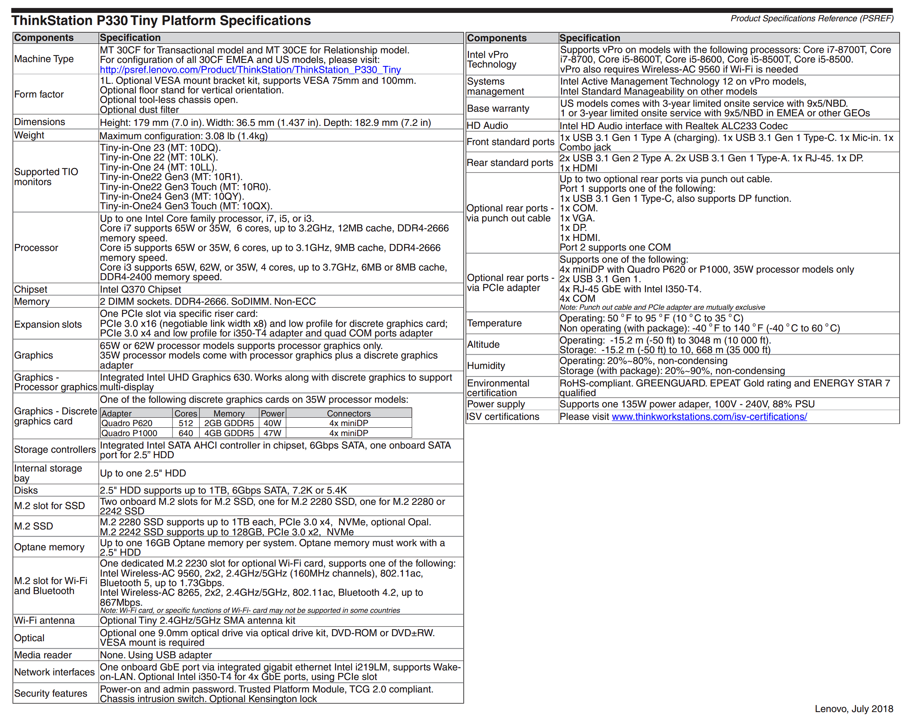

# 参数信息

联想 ThinkStation P330 Tiny 是一款面向专业用户的迷你工作站，凭借其紧凑体积、稳定性能和良好扩展性，在二手市场仍备受关注。以下是其详细介绍：

---

### 📦 基本信息
- **产品系列**：联想 ThinkStation P 系列（工作站）
- **型号后缀**：Tiny（超小型主机）
- **体积**：约 1 升（巴掌大小），支持 VESA 挂装在显示器背面
- **发布年份**：2018–2019 年左右

---

### ⚙️ 主要硬件规格（依配置不同略有差异）

#### 处理器（CPU）
- 支持 Intel 第 8/9 代 Core i3/i5/i7（如 i7-8700T / i9-9900T）
- 部分型号支持 Xeon E-2100/E-2200 系列（支持 ECC 内存）

#### 芯片组
- **Intel Q370**（商用/工作站级芯片组，稳定性强）

#### 内存
- 最高支持 32GB DDR4（部分 Xeon 版本支持 ECC 内存）
- 2 个 SODIMM 插槽

#### 存储
- 1 个 M.2 NVMe SSD（2280）
- 1 个 2.5 英寸 SATA 硬盘位（部分版本支持双硬盘）
- 有用户改装实现三盘位（加装 mSATA 或额外 2.5" 盘）

#### 显卡（GPU）
- 默认集成显卡（UHD Graphics 630）
- **不支持独立显卡**（因体积限制，P330 Tiny 无独显插槽）
    - 注：标准 Tower 版 P330 可配 Quadro RTX 4000 等专业卡，但 Tiny 版不可

#### 接口（典型配置）
- 后置：
    - 4× USB 3.1 Gen1
    - 2× USB 2.0
    - 1× DisplayPort 1.4
    - 1× HDMI 1.4
    - 1× RJ45 千兆网口（部分带 vPro）
    - 音频输入/输出
- 内部：
    - M.2 Key E（用于 Wi-Fi/蓝牙模块）
    - M.2 Key M（NVMe SSD）

#### 电源
- 外置电源适配器（通常为 135W）

---

### ✅ 优势特点
- **工作站级用料**：纯铜散热器、Q370 芯片组、支持 ECC（Xeon 版）
- **稳定性高**：适合 7×24 小时运行（NAS、软路由、虚拟机等）
- **体积小巧**：节省空间，部署灵活
- **性价比高（二手）**：目前二手准系统价格约 300–500 元，成色新

---

### ⚠️ 注意事项
- **无法安装独显**：Tiny 版无 PCIe x16 插槽，图形性能依赖核显
- **内存焊死？**：部分早期型号内存焊死，但多数 P330 Tiny 为可更换 SODIMM
- **BIOS 锁定**：部分企业回收机可能 BIOS 锁定或禁用启动项，需确认解锁状态

---

### 🔧 典型用途（当前流行）
- 家庭 NAS（TrueNAS / UnRAID）
- 软路由 / PVE 虚拟化主机
- 办公电脑 / 远程桌面终端
- Linux 开发测试平台（Ubuntu 官方认证支持）

---

如需官方手册，可参考 [联想知识库 - ThinkStation P330 Tiny 用户指南](https://iknow.lenovo.com.cn/app/detail/177445)。

是否需要推荐具体配置或二手购买建议？